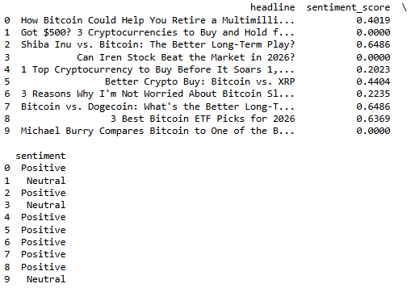
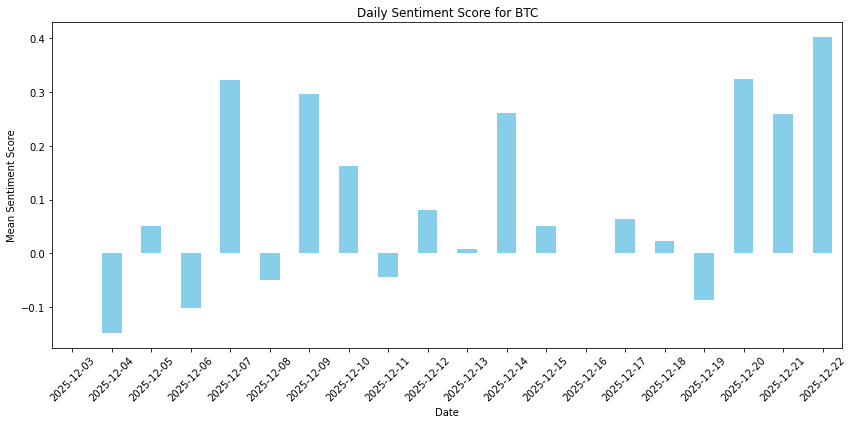

# 📰 Financial News Sentiment Analysis (NLP)

## 📌 Project Overview
This project is an automated Natural Language Processing (NLP) pipeline designed to quantify market sentiment by scraping and analyzing real-time financial news. Using **BeautifulSoup** for web scraping and **NLTK's VADER** for sentiment analysis, the tool evaluates the daily "mood" of the market for specific assets like Bitcoin (BTC).

## 🛠️ Tech Stack
* **Language:** Python
* **Web Scraping:** BeautifulSoup4, Requests
* **NLP Library:** NLTK (VADER Lexicon)
* **Data Analysis:** Pandas, NumPy
* **Visualization:** Matplotlib

## 🔍 Data Pipeline & Engineering
* **Web Scraping:** Extracted real-time headlines from Finviz using custom headers to bypass bot detection.
* **Temporal Logic:** Implemented a tracking variable to handle the source's data structure, ensuring every headline is correctly mapped to its specific publication date.
* **Text Preprocessing:** Automated the cleaning of raw HTML newline characters (`\r\n`) and whitespace to ensure high-quality input for the NLP model.
* **Sentiment Quantification:** Utilized the VADER lexicon to calculate "Compound Scores" ranging from -1 (Extremely Negative) to +1 (Extremely Positive).

---

## 📊 Visual Analysis (Click to Expand)

<b>1. Project Summary & Sentiment Classification</b>

 

This comprehensive overview showcases the data pipeline and the model's ability to classify headlines into **Positive**, **Negative**, or **Neutral** sentiments based on financial context.

**Key Highlight:** The pipeline successfully interprets nuanced financial language, correctly identifying bullish headlines (e.g., "Best Bitcoin ETF Picks") as highly positive.

<b>2. Daily Sentiment Score Trend</b>

 

This bar chart aggregates individual headline scores into a daily mean sentiment. It allows for a clear visualization of whether news coverage is becoming increasingly bullish or bearish over time.

**Key Insight:** The model tracks sentiment shifts over a 20-day period, providing a quantitative "market mood" indicator that can be compared against price action.

---
